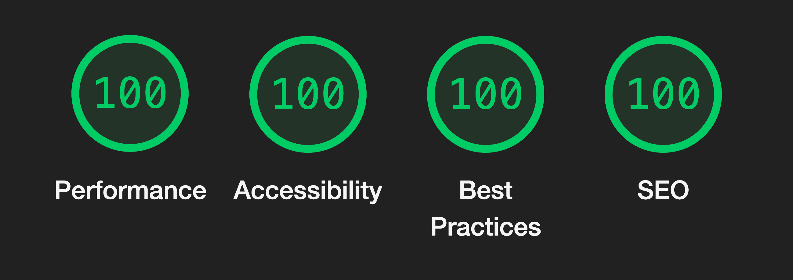

## Portfolio '22

🧑🏽‍🎨  A portfolio platform for '22 and onwards

Whether you are a developer, designer, or creative YOU need to showcase your work uniquely. Portfolio '22 is just what you need. With a modern layout and design, accessibility features, and SEO friendliness this site will ensure a high-quality online location for you and your work

<br>



## ⚒ Tools used

- GatsbyJS <br>
- ReactJS <br>
- Framer motion <br>
- SCSS <br>
- ESLint <br>
- Prettier <br>
- Contentful <br>

[Future]
- Typescript <br>
- Styled components <br>

## 🦶 Features

⚡️ - Asset handler, can take in any cms asset and output any image or video type <br>
✨ - Page transitions to give a smoother web experience <br>
📬 - Easy cms integration using an object layout file <br>
👀 - Perfect SEO, due to required image alts and semantic HTML <br>
👮‍♂️ - Enforce code style guide using ESLint and Prettier <br>

Plenty o' reasons to choose this as your next portfolio site

## 🚀 Quick start

<b>NOTE:</b> the setup of the any CMS or Contentful CMS probably requires some help. Ask the active maintainer of this project for guideance. If you are planning on using Contentful (they have a free tier that fits this template) I can copy my environment over to yours.
There is also a link [here (WIP)] to showcase the json format that is required for this site to work

Clone the project and add your contentful api keys in the `.env` (if you're going to run with contenteful)

```
ACCESS_TOKEN=YOUR ACCESS TOKEN
SPACE_ID=YOUR SPACE ID
```

Run these command to install the required modules and run the site

```
$ npm install
$ npm run develop
```

## 📬 CMS

Check here for a list of CMS's that are compatible with this site
https://www.gatsbyjs.com/docs/conceptual/choosing-a-cms/#1-popular-first-class-gatsby-integrations

## ☑️ Todo's

These todos are features or changes that I have been thinking about, sorted on "priority". When I cross one off I also delete it from the list as to not bloat the readme.

Last updated 10 x 05 x 22

#### Index Page
- [ ] intro poster turn into 3d plane of interactive cards

#### Accesibility
- [ ] Fix Head component to support as many types as possible (create seperate components for type)
- [ ] reduced animation selector

#### About Page
- [ ] create credits and tools section
- [ ] create interactive piece

#### Components
- [ ] Cleanup journals component
  - Remove fixed property so that the component doesn't cover the full site

- [ ] Next Content component
    - Add image on hover like journals component

- [ ] Remove duplicate request modal

#### Styling
- [ ] Advanced mixins (research)
- [ ] Create design system for typography

#### Templates
- [ ] Check if a link is inbound or outbound and add the correct link type

#### Small About
- [ ] Aggregate all data from cms or site-config

#### Journal Page
- [ ] Create seperate intro part
- [ ] Research different layout

#### Developer friendliness
- [ ] Create documentation for this project. Anyone should be able to set this up
- [ ] Setup settings file that set settings for the whole project
